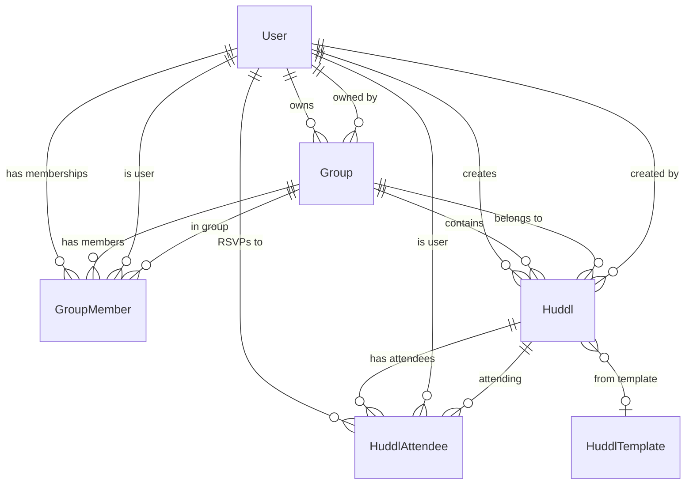
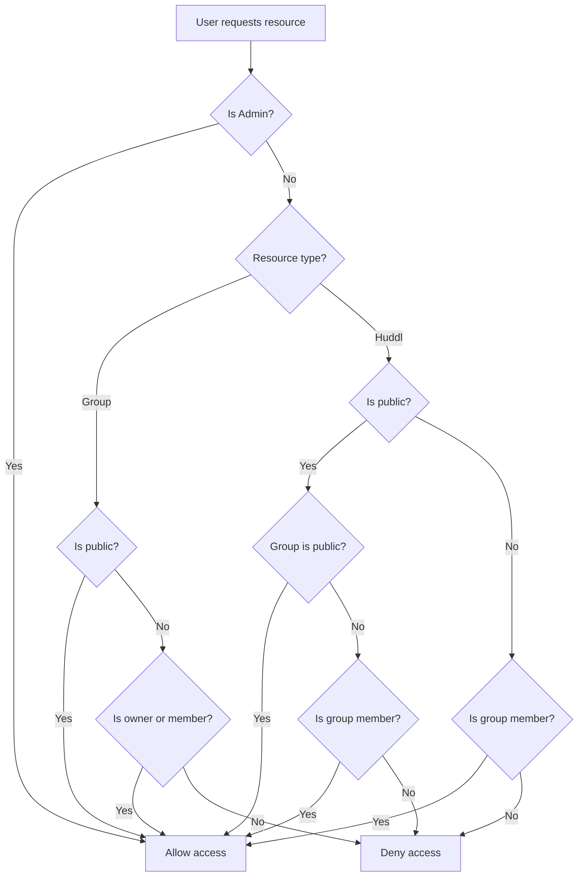
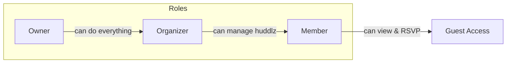
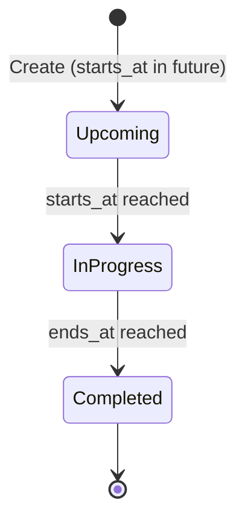

# Architecture

## Entity Relationships

## Group Permissions

| Action               | Admin | Owner | Organizer | Member | Public User | Guest |
|:---------------------|:-----:|:-----:|:---------:|:------:|:-----------:|:-----:|
| View public group    |   ✓   |   ✓   |     ✓     |   ✓    |      ✓      |   ✓   |
| View private group   |   ✓   |   ✓   |     ✓     |   ✓    |      -      |   -   |
| Create group         |   ✓   |   -   |     -     |   -    |      ✓      |   -   |
| Edit group           |   ✓   |   ✓   |     -     |   -    |      -      |   -   |
| Delete group         |   ✓   |   ✓   |     -     |   -    |      -      |   -   |
| View member list     |   ✓   |   ✓   |     ✓     |   ✓    |      -      |   -   |
| Add members          |   ✓   |   ✓   |     ✓     |   -    |      -      |   -   |
| Remove members       |   ✓   |   ✓   |     ✓     |   -    |      -      |   -   |
| Join public group    |   ✓   |   -   |     -     |   -    |      ✓      |   -   |
| Leave group          |   ✓   |   -   |     ✓     |   ✓    |      -      |   -   |

## Huddl Permissions

| Action               | Admin | Owner | Organizer | Creator | Member | Public User | Guest |
|:---------------------|:-----:|:-----:|:---------:|:-------:|:------:|:-----------:|:-----:|
| View public huddl    |   ✓   |   ✓   |     ✓     |    ✓    |   ✓    |      ✓      |   ✓   |
| View private huddl   |   ✓   |   ✓   |     ✓     |    ✓    |   ✓    |      -      |   -   |
| Create huddl         |   ✓   |   ✓   |     ✓     |    -    |   -    |      -      |   -   |
| Edit huddl           |   ✓   |   ✓   |     ✓     |    ✓    |   -    |      -      |   -   |
| Delete huddl         |   ✓   |   ✓   |     ✓     |    ✓    |   -    |      -      |   -   |
| RSVP                 |   ✓   |   ✓   |     ✓     |    ✓    |   ✓    |      ✓      |   -   |
| Cancel own RSVP      |   ✓   |   ✓   |     ✓     |    ✓    |   ✓    |      ✓      |   -   |
| View attendee list   |   ✓   |   ✓   |     ✓     |    ✓    |   ✓*   |      -      |   -   |
| See virtual link     |   ✓   |   ✓   |     ✓     |    ✓    |  ✓**   |      -      |   -   |

\* Members can only see attendee list if they are attending
\*\* Virtual link only visible after RSVP

## Visibility Rules

## Group Member Roles

| Role      | Manage Group | Manage Members | Create Huddlz | Edit Any Huddl | View Private |
|:----------|:------------:|:--------------:|:-------------:|:--------------:|:------------:|
| Owner     |      ✓       |       ✓        |       ✓       |       ✓        |      ✓       |
| Organizer |      -       |       ✓        |       ✓       |       ✓        |      ✓       |
| Member    |      -       |       -        |       -       |       -        |      ✓       |

## Huddl Lifecycle

Status is calculated automatically based on current time:

| Status | Condition |
|--------|-----------|
| `upcoming` | `starts_at > now()` |
| `in_progress` | `starts_at <= now() <= ends_at` |
| `completed` | `ends_at < now()` |

