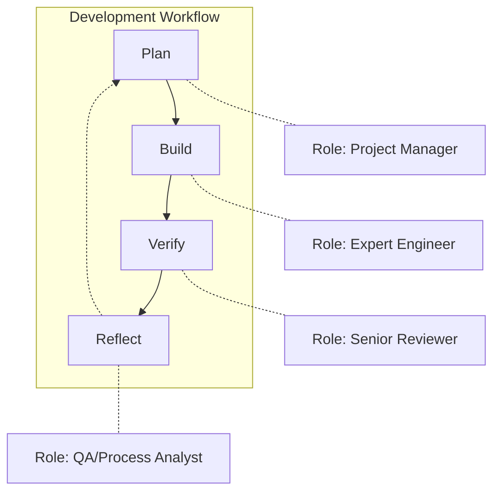

# Development Lifecycle

This document describes the GitHub-integrated development workflow for consistent, high-quality feature delivery.

## Overview

The development process follows a streamlined four-phase workflow:



Each phase activates a different cognitive mode to ensure comprehensive development.

## 1. Planning Phase (`/plan`)

Starting from a GitHub issue, analyze and decompose into manageable tasks:

```
/plan issue=123
```

This phase:
- Deep-dives into requirements with PM mindset
- Creates sub-issues for each discrete task
- Establishes feature branch for development
- Documents insights in Feature Log

### Outputs

- Sub-issues with clear scope and checklists
- Feature branch: `feature/issue-123-description`
- Implementation sequence with dependencies
- Initial learnings captured

## 2. Building Phase (`/build`)

Implement each sub-issue with TDD/BDD discipline:

```
/build issue=123-1
```

This phase:
- Writes tests first, then implementation
- Updates progress in real-time via comments
- Captures course corrections with 🔄 emoji
- Enforces quality gates before completion

### Quality Gates (Mandatory)

Before any task completion:
1. `mix format` - Clean formatting
2. `mix test` - 100% passing
3. `mix credo --strict` - Zero issues
4. `mix test test/features/` - All scenarios pass

### Progress Tracking

- Issue comments show completed items
- Quality gate status updated regularly
- Course corrections documented immediately
- User verification required between tasks

## 3. Verification Phase (`/verify`)

Comprehensive review of the complete feature:

```
/verify issue=123
```

This phase:
- Validates all requirements are met
- Runs comprehensive quality checks
- Tests integration and user experience
- Documents findings in issue comment

### Review Criteria

- Requirements coverage
- Code quality and security
- Performance characteristics
- Test adequacy
- Documentation completeness

### Output

Detailed verification summary posted to issue with:
- Quality gate results
- Issues found and severity
- Recommendations for future work

## 4. Reflection Phase (`/reflect`)

Extract learnings from the complete journey:

```
/reflect issue=123
```

This phase:
- Analyzes all phases from planning to verification
- Identifies patterns and course corrections
- Updates LEARNINGS.md with actionable insights
- Creates follow-up issues for improvements

### Learning Categories

- Technical patterns discovered
- Process improvements identified
- Testing strategies that worked
- Domain knowledge gained

### Outputs

- Updated LEARNINGS.md
- Follow-up issues created
- Process improvement proposals
- Metrics and insights posted to issue

## Key Benefits

### GitHub Integration

- **Transparency**: All work visible in issues
- **Collaboration**: Team members can comment
- **History**: Complete audit trail
- **Metrics**: Track velocity and patterns

### Continuous Learning

- Course corrections captured in real-time
- Patterns emerge from multiple features
- Process evolves based on experience
- Knowledge compounds over time

### Quality Enforcement

- No shortcuts on quality gates
- TDD/BDD as standard practice
- Multiple review checkpoints
- User verification required

## Workflow Tips

1. **Start with clear issues**: Well-written issues lead to better planning
2. **Keep comments updated**: Progress should be visible
3. **Document immediately**: Capture insights as they happen
4. **Close the loop**: Always run reflection phase

## Command Reference

- `/plan issue=123` - Analyze and break down feature
- `/build issue=123-1` - Implement specific task
- `/verify issue=123` - Review complete feature
- `/reflect issue=123` - Extract learnings

See CLAUDE.md for complete documentation.
