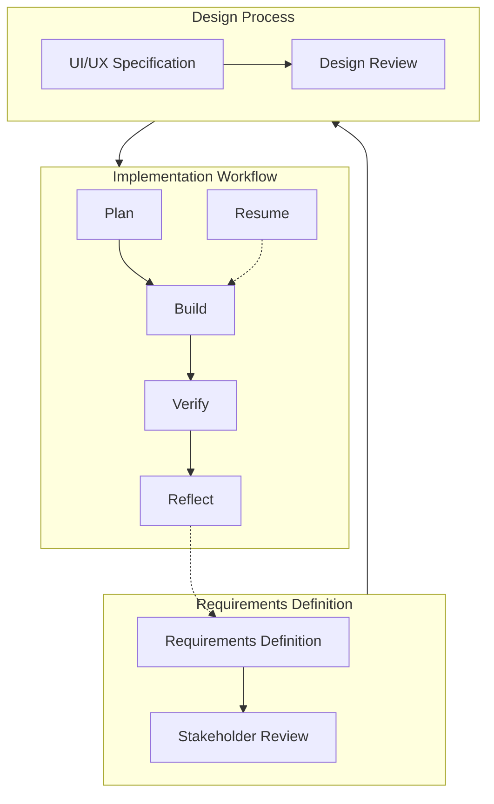

# Complete Product Development Lifecycle

This document illustrates the complete product development lifecycle, connecting requirements definition, design, implementation, and learning phases.

## Overview

The development process consists of three interconnected workflows:



Each workflow has its own focus, but they connect to form a complete cycle.

## 1. Requirements Definition Workflow

Use the `/define` command to specify product requirements:

```
/define id="feature_id" title="Feature Title"
```

This phase:
- Defines the problem and user needs
- Specifies functional requirements
- Sets acceptance criteria
- Creates a document in `docs/requirements/` 

### When to Use

- For all significant new features
- When making substantial changes to existing features
- When implementing complex business logic

### When to Skip

- For minor bug fixes
- For simple enhancements to existing features
- When requirements are already well-defined elsewhere

## 2. Design Process

The Huddlz project uses DaisyUI as its primary UI component library, allowing for consistent design without requiring extensive custom UI creation. The design process is integrated into the planning phase:

1. Identify required UI elements based on requirements
2. Select appropriate components from DaisyUI
3. Plan layout and responsive behavior
4. Document component choices with references to DaisyUI docs
5. Note any customizations needed

### DaisyUI Integration

The UI Component Selection section in planning notes should include:
- Specific DaisyUI components to use (buttons, cards, etc.)
- Layout structure decisions
- Responsive design approach
- Theme customizations
- Links to relevant DaisyUI documentation

This component-based approach ensures consistency while reducing design overhead. For complex UI requirements that exceed DaisyUI's capabilities, custom design work can be documented in:
- `docs/designs/[feature_id]/`

## 3. Implementation Workflow

Follow the standard implementation workflow:

1. **Plan**: Analyze requirements and design solution
   ```
   /plan prd_id="feature_id"
   ```

2. **Build**: Implement the solution
   ```
   /build notes_file="path/to/notes"
   ```

3. **Verify**: Review and ensure quality
   ```
   /verify notes_file="path/to/notes"
   ```

4. **Reflect**: Capture learnings
   ```
   /reflect notes_file="path/to/notes"
   ```

If interrupted, use:
```
/resume notes_file="path/to/notes"
```

See `/workflow` for detailed implementation instructions.

## Scaling the Process

### For Large Features

- Complete all phases thoroughly
- Maintain detailed documentation at each stage
- Consider breaking into multiple PRDs and implementation cycles

### For Medium Features

- Complete PRD and implementation workflow
- Simplify design phase if UI changes are minimal
- Combine some implementation steps for efficiency

### For Small Tasks and Bug Fixes

- Use the QuickFix workflow for minor issues:
  ```
  /quickfix description="Button alignment issue on signup form" issue_id="signup-btn-123"
  ```
- This creates a lightweight notes file without requiring a formal PRD
- Still captures learnings for reflection
- Follows streamlined implementation workflow

## Knowledge Management

Maintain knowledge across all phases:

- PRD learnings update future requirements
- Design patterns are documented in design system
- Implementation insights captured in `LEARNINGS.md`

### Automatic Session Documentation

All substantial work is automatically documented through session notes, regardless of workflow:

1. **For Workflow-Based Development**:
   - Session notes complement the structured workflow notes
   - `/plan`, `/build`, etc. create workflow-specific documentation
   - Automatic session notes capture the broader context and discussion

2. **For Meta-Work and Exploration**:
   - When no specific workflow applies, session notes become the primary documentation
   - Notes are automatically created at `notes/session-YYYYMMDD-topic.md`
   - No command needed - documentation happens proactively

These session notes can be:
- Reflected on using `/reflect notes_file="path/to/session_notes.md"`
- Added to the knowledge repository
- Linked to relevant documentation
- Used to track decisions and rationales

## Command Reference

- `/define` - Define feature requirements
- `/plan` - Plan implementation based on requirements
- `/build` - Build the solution
- `/verify` - Verify implementation quality
- `/reflect` - Document learnings
- `/resume` - Resume work after interruption
- `/workflow` - View detailed implementation workflow
- `/quickfix` - Handle small changes and bug fixes
