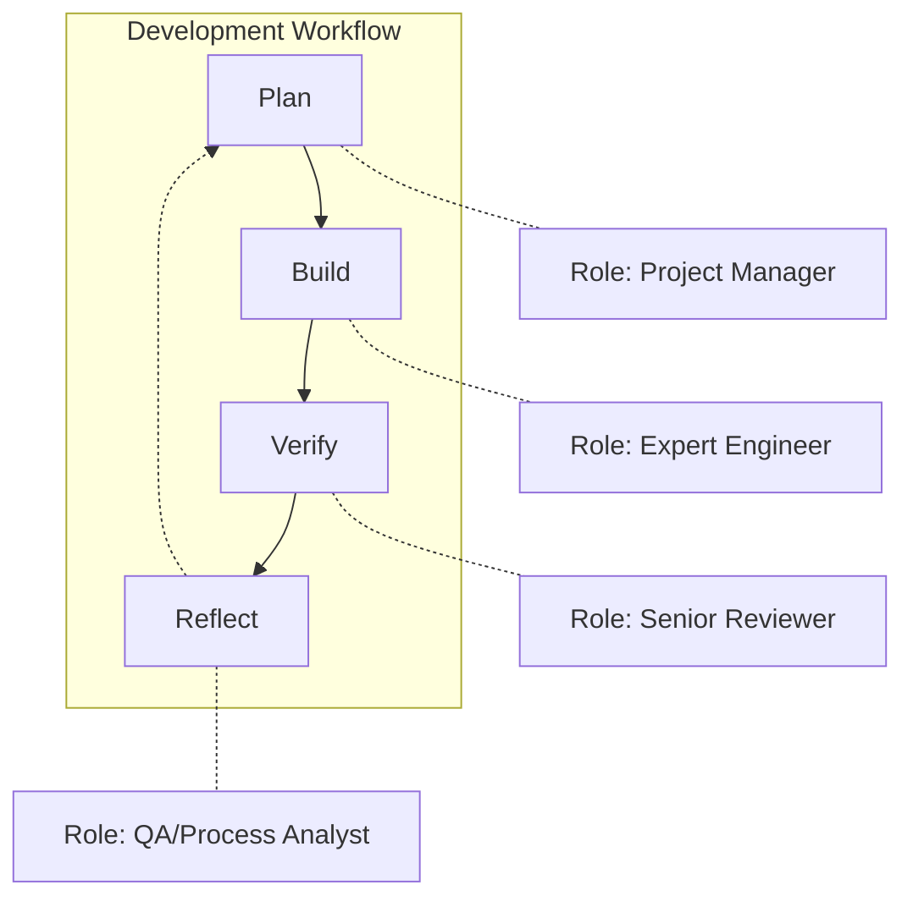

# Complete Product Development Lifecycle

This document illustrates the complete product development lifecycle, connecting requirements definition, design, implementation, and learning phases.

## Overview

The development process follows a streamlined four-phase workflow:



Each phase activates a different cognitive mode to ensure comprehensive development.

## 1. Planning Phase (`/plan`)

The planning phase analyzes requirements and breaks them into manageable tasks:

```
/plan description="User Authentication"
```

This phase:
- Analyzes the feature requirements deeply
- Breaks down work into context-window-sized tasks
- Creates detailed task specifications
- Establishes implementation sequence

### Purpose

- Activate "Project Manager" cognitive mode
- Understand the full scope of work
- Identify dependencies and challenges
- Create clear, actionable tasks

## 2. Building Phase (`/build`)

The building phase implements tasks with rigorous quality standards:

```
/build task_dir="20250124_user_authentication"
```

This phase:
- Implements one task at a time in sequence
- Follows test-driven development (TDD/BDD)
- Enforces quality gates before completion
- Automatically resumes in-progress work

### Quality Gates (Mandatory)

Before any task can be marked complete:
1. `mix format` - Zero formatting changes
2. `mix test` - 100% pass rate
3. `mix credo --strict` - Zero issues
4. `mix test test/features/` - All behavior tests pass

### Purpose

- Activate "Expert Engineer" cognitive mode
- Write tests before implementation
- Maintain high code quality standards
- Document decisions and challenges

## 3. Verification Phase (`/verify`)

The verification phase performs comprehensive review:

```
/verify task_dir="20250124_user_authentication" commit=true
```

This phase:
- Reviews entire feature implementation
- Runs all tests and quality checks
- Identifies integration issues
- Optionally commits approved changes

### Purpose

- Activate "Senior Reviewer" cognitive mode
- Critical evaluation of code quality
- Ensure requirements are met
- Find gaps or improvements

## 4. Reflection Phase (`/reflect`)

The reflection phase extracts learnings:

```
/reflect task_dir="20250124_user_authentication"
```

This phase:
- Analyzes the entire development process
- Identifies what worked well and what didn't
- Updates LEARNINGS.md with insights
- Suggests process improvements

### Purpose

- Activate "QA/Process Analyst" cognitive mode
- Build institutional knowledge
- Improve future development cycles
- Document lessons learned

## Scaling the Process

### For Large Features

- Complete all phases thoroughly
- Maintain detailed documentation at each stage
- Consider breaking into multiple requirements documents and implementation cycles

### For Medium Features

- Complete requirements definition and implementation workflow
- Simplify design phase if UI changes are minimal
- Combine some implementation steps for efficiency

### For Small Tasks and Bug Fixes

- Use simplified workflow without full task breakdown
- Start directly with implementation
- Still enforce quality gates
- Document learnings in session notes

## Knowledge Management

Maintain knowledge across all phases:

- Requirements document learnings update future specifications
- Design patterns are documented in design system
- Implementation insights captured in `LEARNINGS.md`

### Knowledge Capture Throughout

Knowledge is captured continuously during development:

1. **During Planning**: Discovery of unknown requirements, edge cases
2. **During Building**: Implementation realities, technical challenges
3. **During Verification**: Quality gaps, missing tests
4. **During Reflection**: Patterns, improvements, lessons learned

All insights feed back into the process, improving each iteration.

## Command Reference

Core workflow commands:
- `/plan` - Analyze requirements and create task breakdown
- `/build` - Implement tasks with TDD/BDD approach
- `/verify` - Review complete feature and ensure quality
- `/reflect` - Extract learnings and improve process
- `/workflow` - View detailed implementation workflow

See CLAUDE.md for complete command documentation and usage examples.
