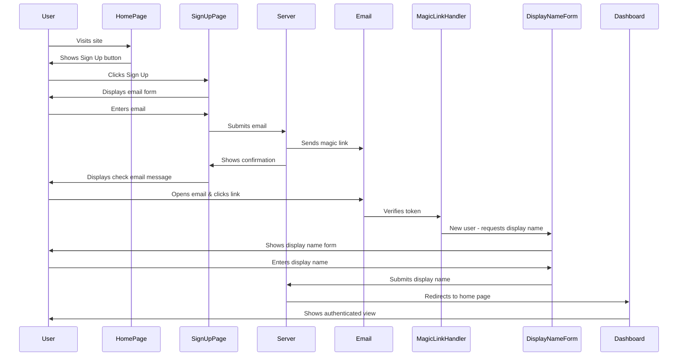

# PRD 0002: Signup with Magic Link - Development Notes

## PRD Tracking
- PRD File Path: docs/requirements/0002_signup_with_magic_link.md
- Last Modified: May 5, 2025, 07:53:54
- Version: 1.0
- Status: Draft

## Requirements Analysis

### Explicit Requirements
1. **User Input**
   - Users enter their email address to initiate signup
   - Email validation requires "@" symbol
   - Users provide display name after magic link verification

2. **System Flow**
   - System generates and sends magic link to provided email
   - Magic links must be secure and have appropriate expiration
   - User accounts created and activated upon flow completion
   - Users automatically signed in after completing signup

3. **UI/UX Requirements**
   - Responsive design working on mobile and desktop
   - Clean, simple, focused signup form
   - Clear instructions and feedback throughout process
   - Appropriate error states and resolution guidance

4. **Performance Requirements**
   - Magic links delivered promptly (within 1 minute)
   - Complete signup flow within 2-3 minutes
   - Handle concurrent signup requests appropriately

### Implicit Requirements
1. **Security**
   - Secure storage of user information
   - Protection against enumeration attacks
   - Secure handling of authentication tokens

2. **User Experience**
   - Seamless transition between steps in the signup flow
   - Consistent branding and design language
   - Accessibility considerations

3. **Technical**
   - Integration with existing user authentication system
   - Proper session management
   - Email deliverability and handling of email errors

### Current Implementation Analysis

After examining the codebase, I found that:

1. **Authentication Framework:**
   - The application uses the Ash Framework with AshAuthentication
   - Magic link authentication is already configured in the `User` resource
   - The `SendMagicLinkEmail` module handles sending magic links
   - The magic link flow for sign-in is already implemented

2. **User Model:**
   - The User model is defined in `Huddlz.Accounts.User`
   - It currently only has an email attribute but lacks a display name field
   - The user table in Postgres doesn't have a display name column yet

3. **Authentication Routes:**
   - Auth routes are set up in `HuddlzWeb.Router`
   - The AuthController handles successful and failed authentication
   - The LiveUserAuth module manages LiveView authentication

4. **Testing:**
   - Sign-in using magic links is already tested in Cucumber features
   - Features cover requesting a magic link and validation scenarios
   - Test steps for validating email address and checking for errors exist

### What's Missing from Current Implementation
1. **User Display Name:**
   - Need to add display name attribute to User schema
   - Need to add display name form after magic link verification
   - Need to update database schema with migration

2. **Sign-up Specific Flow:**
   - Current flow handles both sign-in and sign-up with the same flow
   - Need to differentiate between sign-in and sign-up in UI/UX
   - Need to add explicit "Sign Up" button on homepage

3. **User Experience:**
   - Need clear distinction between sign-up and sign-in flows
   - Need proper confirmation screens for sign-up completion

## Solution Design

Based on my analysis of the codebase and requirements, I propose the following implementation plan:

### 1. Database and Schema Updates

1. **Add Display Name to User Schema:**
   - Create a migration to add a `display_name` column to the users table
   - Update the `Huddlz.Accounts.User` module to include a display_name attribute
   - Set appropriate validations (non-null, string type)

### 2. Authentication Flow Updates

1. **Modify Magic Link Authentication:**
   - Extend the existing magic link authentication flow to handle display name collection
   - Create a new LiveView component for the display name form
   - Update the auth controller to show the display name form after magic link verification for new users

2. **Update Sign-in vs Sign-up UX:**
   - Update the homepage to include explicit "Sign In" and "Sign Up" buttons
   - Create customized sign-up form with explanatory text
   - Ensure sign-up and sign-in lead to different UI components while using the same underlying mechanism

### 3. Implementation Components

1. **User Schema Updates:**
   ```elixir
   # In User schema
   attributes do
     uuid_primary_key :id
     attribute :email, :ci_string, allow_nil?: false, public?: true
     attribute :display_name, :string, allow_nil?: false, public?: true
   end
   ```

2. **Magic Link Flow Extension:**
   - Create a new LiveView component for capturing display name
   - Add a function to check if a user is new (no display_name) or returning
   - Add display name capture step after successful magic link verification for new users

3. **Authentication Controller Updates:**
   - Modify success handler to check for display_name and route accordingly
   - Update auth controller to handle display name submission

### 4. Security Considerations

1. **Prevent Enumeration Attacks:**
   - Always show the same success message regardless of whether the email exists
   - Use timing-safe comparisons for email lookups

2. **Input Validation:**
   - Validate display name on both client and server
   - Set reasonable length limits on display name

### 5. Testing Approach

1. **Update Cucumber Features:**
   - Create new feature tests for the sign-up flow
   - Update existing sign-in tests to account for the new UX
   - Add tests for display name collection
   - Add validation tests for display name inputs

2. **User Experience Testing:**
   - Test the complete flow from sign-up through magic link to display name collection
   - Test error handling and validation
   - Test that returning users don't see the display name form



### Assumptions
1. The project already has email delivery capabilities via Swoosh (confirmed)
2. The user model can support magic link authentication (confirmed)
3. The project uses Phoenix LiveView for UI components (confirmed)
4. Ash Authentication is used for authentication (confirmed)
5. Existing magic link flow can be extended for sign-up

### Areas Requiring Clarification (Resolved)
1. What exactly should happen if a user tries to sign up with an email that already exists?
   - **Resolution**: Show a generic message that the email was sent, regardless of whether the account exists or not. This prevents enumeration attacks.

2. What is the exact expiration time for magic links?
   - **Resolution**: Use Ash Authentication default expiration times for now. This can be updated in the future if needed.

3. What page should users be directed to after successful signup?
   - **Resolution**: Direct users to the home page after successful signup. In the future, we may redirect them back to what they were doing.

4. Are there any specific email templates or branding requirements for the magic link email?
   - **Resolution**: Use a generic email template for now. Branding and design will be addressed later when we have a better understanding of marketing requirements.

5. Is there any rate limiting required for the signup process?
   - **Resolution**: Rate limiting should be implemented, but it will be added to the roadmap for future implementation (not part of this task).